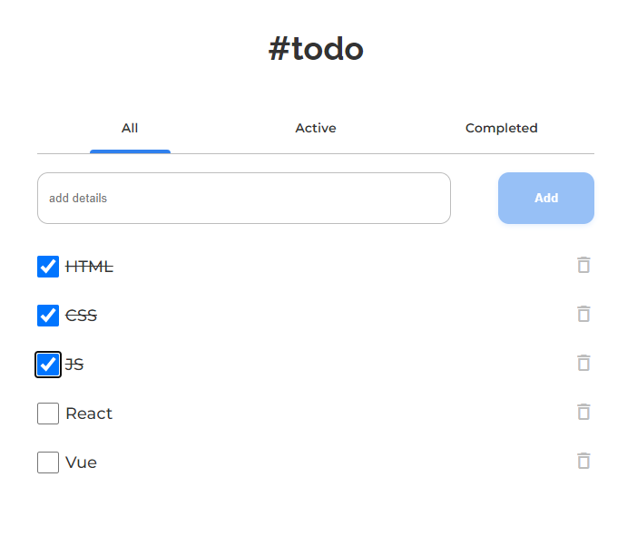

<h1 align="center">Todo App (VueJS Exercies)</h1>

<div align="center">
   Solution for a challenge from  <a href="http://devchallenges.io" target="_blank">Devchallenges.io</a>.
</div>

<div align="center">
  <h3>
    <a href="https://todo-vue-aoa97.netlify.app/">
      Demo
    </a>
    <span> | </span>
    <a href="https://devchallenges.io/solutions/xc0n2qn9ZDertq9aacjK">
      Solution
    </a>
    <span> | </span>
    <a href="https://devchallenges.io/challenges/hH6PbOHBdPm6otzw2De5">
      Challenge
    </a>
  </h3>
</div>

<!-- TABLE OF CONTENTS -->

## Table of Contents

- [Overview](#overview)
  - [Built With](#built-with)
- [Features](#features)
- [How to use](#how-to-use)
- [Contact](#contact)

<!-- OVERVIEW -->

## Overview

<div align="center">

</div>

### Built With

<!-- This section should list any major frameworks that you built your project using. Here are a few examples.-->

- [Vue.js](https://vuejs.org/)

## Features

<!-- List the features of your application or follow the template. Don't share the figma file here :) -->

This application was created as a submission to Devhallenges [challenge](https://devchallenges.io/challenges/hH6PbOHBdPm6otzw2De5)

- User can add a new task
- User can check to complete a task
- User can between All, Active and Completed
- User can remove one or all tasks under the Completed tab
- User can store the data in local storage that when refreshing the page, User can still see my progress
- User can view the application on different screens

## How To Use

<!-- Example: -->

To clone and run this application, you'll need [Git](https://git-scm.com) and [Node.js](https://nodejs.org/en/download/) (which comes with [npm](http://npmjs.com)) installed on your computer, [Vue-cli](https://cli.vuejs.org/guide/installation.html) From your command line:

```bash
# Install Vue Cli
$ npm install -g @vue/cli

# Clone this repository
$ git clone https://github.com/aoa97/todo-vue

# Install dependencies
$ npm install

# Run the app
$ vue serve
```

## Contact

- GitHub [@aoa97](https://github.com/aoa97)
- LinkedIn [@aoa97](https://www.linkedin.com/in/engahmedusama/)
